# One capture-to-teaching system

For the October 4 screen capture audit and implementation tradeoffs, see
[capture reliability](capture-reliability.md).

ElevenLabs conversational capture remains the default. Gemini or Qwen reasons behind the same UI;
the bounded apprentice is optional. Both paths share evidence and the draft-skill contract.
The authoritative teachable map is skills, not the orchestration checkpoint.

```mermaid
flowchart LR
 Browser[Bound website tab] --> Queue[Durable queue]
 Voice[ElevenLabs transcript] --> Queue
 Queue --> Evidence[Supabase events and transcript segments]
 Evidence --> Interview[Shared interview coordinator]
 Interview --> Checkpoint[Provisional checkpoint]
 Evidence --> Builder[Configured model builder]
 Checkpoint --> Builder
 Builder --> Draft[Atomic draft skills]
 Draft --> Review[Expert review and teach-back]
 Review --> Published[Approved versions]
 Published --> Snapshot[Pinned tutoring snapshot]
 Snapshot --> Rules[Deterministic guardrails]
 Rules --> Attempts[Attempts and mastery]
```



| Boundary | Implementation | Invariant |
| --- | --- | --- |
| Capture | Capture.tsx, captureQueue.ts, routes/capture.py | Stable IDs, one tab, storage before reasoning, Stop drains |
| Model API | api_llm.py, llm.py | One provider per request; schema validation; Gemini Flash allowlist or OpenRouter zero-price routing; no automatic fallback |
| Interview | agent/interview.py, agent/persistence.py | Recorded delivery before answers; checkpoints do not duplicate raw evidence |
| Knowledge | knowledge.py, store.py | Exact on-record expert quote and same-session event; executable conditions agree with field definitions |
| Review | routes/workmaps.py, migration 004 | Atomic revisions, expected versions, publication retained until successor approval |
| Debrief | Capture teach-back routes, Expert.tsx | Reviewed summary; explicit confirmation of presented revision; pending answers block completion |
| Tutoring | routes/tutor.py, rules.py, Tutor.tsx | Immutable snapshots, unknown fields block, first prediction before first save determines mastery |
| Access | access.py, AccessGate.tsx | Loopback development; authenticated membership, roles and ownership for public use |

PostgreSQL RPCs lock rows and commit each domain operation atomically. Lost responses
can be retried with the original identity. Conflicting payloads cannot overwrite facts.
Models do not approve skills or determine mastery. Adding a Gemini key selects Gemini
when LLM_PROVIDER is auto; explicit gemini/openrouter settings select a provider.
Gemini defaults to gemini-3.5-flash-lite after its successful synthetic Work Map
test; gemini-3.8-flash is an explicit option, not an automatic fallback.
All backend model boundaries use that selection, including bounded interviews;
the legacy request label qwen identifies bounded mode, not a forced API provider.
The ElevenLabs conversation keeps its own configured voice model. No model call
is needed for raw action/text capture by default. Work Maps still require a model.

Gemini uses Google's OpenAI-compatible API without adding an SDK. Keys remain
backend-only. Use a Google **Free tier** project with billing disabled: the model
allowlist cannot establish project billing status or enforce a $0 provider cap.
Free quotas can fail; responses never trigger an automatic provider/model switch.
Free-tier demonstrations use synthetic data because Google may use submitted
content to improve its products. See [Google pricing](https://ai.google.dev/gemini-api/docs/pricing)
and [API compatibility](https://ai.google.dev/gemini-api/docs/openai).

## Database

Fresh project: run scripts/db.sql, then migrations **003 and 004**. The base already
includes 001 and 002; do not repeat them. Existing projects apply only missing migrations
in order. Audit bootstrap/assertions are for the disposable local database only.

Migration 004 retains existing skills and evidence, adds transactional operations and
backfills legacy training snapshots from currently available versions. Historical versions
overwritten before this migration cannot be reconstructed. Existing approved skills remain
published; new drafts use the stronger evidence contract.

## Run on another computer

```sh
git clone https://github.com/sebastiantorrescodes/hack-nation-7.git
cd hack-nation-7
git switch vincent/AgentsWorflow
cd backend
python3 -m venv .venv
.venv/bin/python -m pip install -r requirements.txt
cp .env.example .env
```

Fill .env locally with team database/provider configuration, apply migrations, then run:

```sh
.venv/bin/python -m uvicorn app.main:app --host 127.0.0.1 --port 8000
```

In another terminal from extension/ run npm install and npm run build. Load extension/dist
as an unpacked Chrome extension, refresh the test website and open the panel. Never commit
.env or bundle the Supabase service key into the extension. This is local judge setup,
not a hosted one-click link. These changes need a commit and push before a new clone includes them.

## Public access

Keep APP_AUTH_MODE=local on this computer. It refuses remote/forwarded anonymous requests.
A hosted backend needs APP_AUTH_MODE=supabase, SUPABASE_PUBLIC_KEY, the backend-only service
key, HTTPS and the intended FRONTEND_ORIGIN. Build the extension with
VITE_API_BASE=https://your-backend-host (no trailing slash). The backend does not serve
the extension panel as a standalone website.

An administrator creates/invites Supabase Auth accounts and maps their Auth UUIDs to
application users. Membership is never self-granted. For an already-created expert account:

```sql
with member as (
 insert into public.users(name,role) values ('Team expert','expert') returning id
)
insert into public.app_members(auth_id,user_id,role)
select 'REPLACE_WITH_AUTH_USER_UUID'::uuid,id,'expert' from member;
```

Use trainee in both role positions for trainees. Account creation and membership are
explicit deployment actions, not migration side effects. Before sharing a hosted link,
test two accounts: trainees must fail expert writes and experts must fail private reads
of another expert's session. Legacy unowned sessions are administrator-only in public mode.
Tokens stay in Chrome session storage; expiry prompts sign-in again, with no background
refresh flow yet. Browser Supabase keys cannot invoke domain write RPCs.

No public deployment or team-account membership was activated during this local refactor.
See [verification and hands-on checks](functional-verification.md).
